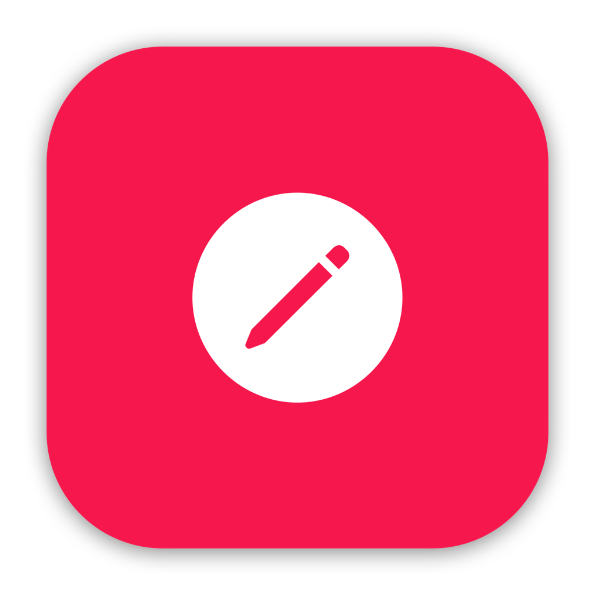

    
    <h1 align="center">
        Xedit for macOS 13+
    </h1>

 

    

 

 

<h1 style="border-bottom: 0;" align="center">What is Xedit</h1>

    Xedit is an Open Sourced IDE for macOS. It is heavily inspired by Xocde and CodeEdit. The goal of Xedit is to provide powerful tools like Xcode but to support a larger range of languages and provide tools for cross platform development to target other machines that are not Apple related.

 
<h1 style="border-bottom: 0;" align="center">Why Xedit</h1>

Because most IDEs are Windows/Linux Only or do not look that good on macOS, it is time for a new age of IDE development where the software will look as modern and be as powerful as the default tool given by Apple (Xcode). Applications like Visual Studio Code, Jetbrains, Sublime Text, etc are good but they do not utilise the full potential of Apple APIs. This IDE is purely built on Apple tools. It will utlise all the potential power your system has to offer to provide the ultimate development service tailored for your needs.

 
<h1 style="border-bottom: 0;" align="center">When Release</h1>

It is too early to speak for a release date. Once Xedit has basic functionality, a release date will be confirmed.

 
<h1 style="border-bottom: 0;" align="center">Authors</h1>

- shabman - Fullstack (Objective-C, C/C++)
- Krishpranav - Backend

Please see license for more:

`Copyright (C) 2023 Xedit. All Rights Reserved.`